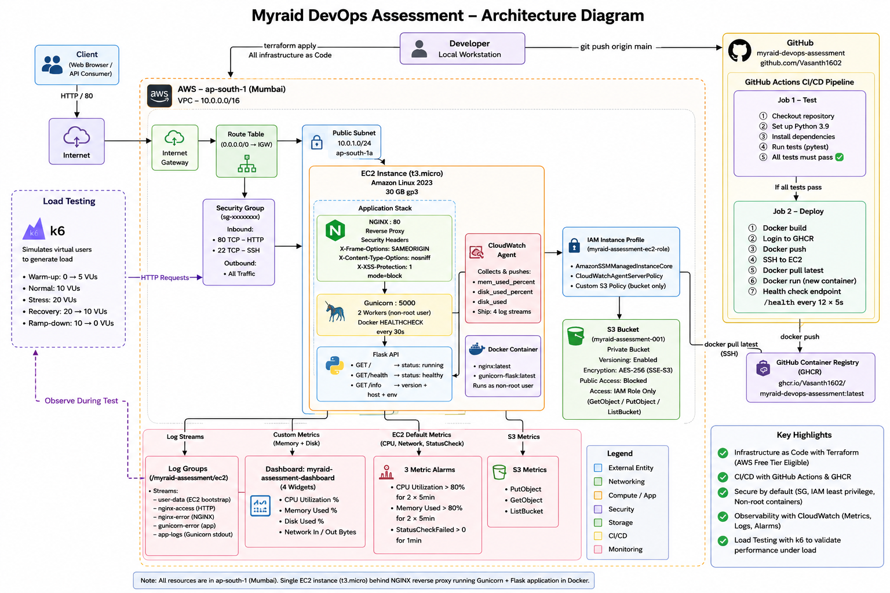

# Myraid DevOps Assessment

A production-like Flask API deployed on AWS using Terraform, Docker, NGINX, and GitHub Actions CI/CD. Built as part of the Myraid DevOps Engineer technical assessment.

---

## Table of Contents

- [Overview](#overview)
- [Architecture](#architecture)
- [Repository Structure](#repository-structure)
- [Technology Stack](#technology-stack)
- [Prerequisites](#prerequisites)
- [Infrastructure](#infrastructure)
- [CI/CD Pipeline](#cicd-pipeline)
- [API Endpoints](#api-endpoints)
- [Monitoring and Observability](#monitoring-and-observability)
- [Security](#security)
- [Load Testing](#load-testing)
- [Setup Guide](#setup-guide)
- [Design Decisions](#design-decisions)
- [Trade-offs](#trade-offs)
- [Cost Awareness](#cost-awareness)
- [Future Improvements](#future-improvements)
- [Demo Video](#demo-video)
- [Documentation Index](#documentation-index)

---

## Overview

This project demonstrates end-to-end cloud engineering by deploying a Python Flask API on AWS infrastructure provisioned entirely with Terraform. Every push to `main` automatically triggers a fully automated CI/CD pipeline with 2 jobs and 8 stages — from code validation through Docker build, GHCR push, EC2 deployment, and health check gate.

**Key highlights:**
- **100% Infrastructure as Code** — every AWS resource is Terraform-managed
- **Zero manual deployments** — all application changes deploy via GitHub Actions
- **Multi-layer security** — IAM least privilege, NGINX security headers, non-root container, S3 encryption
- **Full observability** — 4 CloudWatch log streams, 3 metric alarms, 1 dashboard with 4 widgets
- **Load tested** — k6 load test at 20 VUs, 0% error rate, full results in `docs/load-testing-report.md`

---

## Architecture



### Component Summary

| Layer | Component | Details |
|---|---|---|
| Developer | Local workstation | `terraform apply` + `git push` |
| Source Control | GitHub | `github.com/Vasanth1602/myraid-devops-assessment` |
| CI/CD | GitHub Actions | 2 jobs (test + deploy), 8 stages |
| Registry | GHCR | `ghcr.io/vasanth1602/myraid-devops-assessment:latest` |
| Network | AWS VPC | `10.0.0.0/16`, ap-south-1, Internet Gateway, Public Subnet |
| Compute | EC2 t3.micro | Amazon Linux 2023, 30 GB gp3, IAM role attached |
| Reverse Proxy | NGINX :80 | Security headers, `server_tokens off`, proxy to Gunicorn |
| App Server | Gunicorn :5000 | 2 workers, non-root `appuser`, Docker HEALTHCHECK |
| Application | Flask API | `GET /`, `GET /health`, `GET /info` |
| Storage | S3 | Versioning, AES-256 encryption, public access blocked |
| Monitoring | CloudWatch | Dashboard (4 widgets), 3 alarms, 4 log streams |

---

## Repository Structure

```
myraid-devops-assessment/
│
├── app/
│   ├── app.py                    # Flask API — /, /health, /info endpoints
│   ├── requirements.txt          # flask==3.0.3, gunicorn==22.0.0, pytest==8.2.2
│   ├── Dockerfile                # Multi-stage build, non-root appuser, HEALTHCHECK
│   └── tests/
│       ├── __init__.py
│       └── test_app.py           # 3 pytest tests — all endpoints, all assertions
│
├── terraform/
│   ├── provider.tf               # AWS provider, version constraints
│   ├── main.tf                   # All resources: VPC, SG, IAM, EC2, S3, CW Dashboard, Alarms
│   ├── variables.tf              # 6 input variables with sensible defaults
│   ├── outputs.tf                # 7 outputs: IP, URLs, instance ID, S3, dashboard URL
│   ├── user_data.sh              # EC2 bootstrap: Docker + NGINX + CloudWatch Agent
│   └── terraform.tfvars.example  # Template — copy to terraform.tfvars and fill in
│
├── .github/
│   └── workflows/
│       └── deploy.yml            # CI/CD: 2 jobs, 8 stages, test-gates-deploy
│
├── load-testing/
│   ├── k6-script.js              # k6 load test: 5 stages, 20 max VUs, 3 endpoints
│   └── results-summary.json      # Actual test results (auto-generated by k6)
│
├── docs/
│   ├── architecture-diagram.png  # Full system architecture diagram
│   ├── deployment-guide.md       # Step-by-step deployment guide from scratch
│   ├── security-summary.md       # Security controls, trade-offs, hardening recommendations
│   ├── load-testing-report.md    # k6 methodology, results, bottleneck analysis
│   ├── final-report.md           # Complete assessment summary
│   ├── demo-video.mp4            # 8-minute implementation and demo video
│   ├── App in browser.png        # Screenshot — live app /health endpoint
│   ├── EC2 instance.png          # Screenshot — EC2 running in AWS Console
│   ├── S3 bucket.png             # Screenshot — S3 versioning + encryption
│   ├── CloudWatch Dashboard.png  # Screenshot — 4-widget monitoring dashboard
│   ├── CloudWatch Alarms.png     # Screenshot — 3 alarms in OK state
│   ├── CloudWatch Log Groups.png # Screenshot — 4 log streams active
│   ├── GitHub Actions.png        # Screenshot — green CI/CD pipeline run
│   └── k6 terminal .png          # Screenshot — load test results output
│
├── .gitignore
└── README.md
```

---

## Technology Stack

| Layer | Technology | Version |
|---|---|---|
| Cloud Provider | AWS | — |
| Region | ap-south-1 (Mumbai) | — |
| IaC | Terraform | >= 1.5.0 |
| OS | Amazon Linux 2023 | Latest AMI (dynamic) |
| Application | Python + Flask | 3.9 / 3.0.3 |
| WSGI Server | Gunicorn | 22.0.0 |
| Containerization | Docker (multi-stage) | Latest |
| Container Registry | GitHub Container Registry (GHCR) | — |
| Reverse Proxy | NGINX | Latest (DNF) |
| CI/CD | GitHub Actions | — |
| Monitoring | AWS CloudWatch Agent | — |
| Load Testing | k6 | 2.1.0 |

---

## Prerequisites

### Required Tools

| Tool | Version | Purpose |
|---|---|---|
| [Terraform](https://developer.hashicorp.com/terraform/install) | >= 1.5.0 | Infrastructure provisioning |
| [AWS CLI](https://aws.amazon.com/cli/) | v2 | AWS authentication |
| [Git](https://git-scm.com/) | Any | Version control |
| [k6](https://k6.io/docs/get-started/installation/) | Any | Load testing (optional) |

### AWS Account Setup

1. Create an IAM user with programmatic access
2. Configure the AWS CLI:
```bash
aws configure
# Enter: Access Key ID, Secret Access Key, region (ap-south-1), output format (json)
```
3. Verify:
```bash
aws sts get-caller-identity
```

### EC2 Key Pair (Manual Step)

The EC2 SSH key pair must be created manually in the AWS Console — Terraform references it by name but does not create it.

1. **AWS Console → EC2 → Network & Security → Key Pairs → Create key pair**
2. Name: `myraid-assessment-key` | Type: RSA | Format: `.pem`
3. Store the downloaded `.pem` file safely — it cannot be re-downloaded
4. Never commit it to Git (already in `.gitignore`)

---

## Infrastructure

All infrastructure is provisioned by Terraform in `terraform/main.tf` (422 lines). Zero manual console clicks are required after the key pair setup.

### Networking

| Resource | Value | Purpose |
|---|---|---|
| VPC | `10.0.0.0/16` | Isolated network, DNS support + hostnames enabled |
| Public Subnet | `10.0.1.0/24` | Hosts EC2 in ap-south-1a |
| Internet Gateway | — | Routes internet traffic into VPC |
| Route Table | `0.0.0.0/0 → IGW` | Public routing |

### Security Group

| Direction | Port | Source | Purpose |
|---|---|---|---|
| Inbound | 80 TCP | `0.0.0.0/0` | HTTP application access |
| Inbound | 22 TCP | `0.0.0.0/0` | SSH (assessment trade-off — see Trade-offs) |
| Outbound | All | `0.0.0.0/0` | Package installs, Docker pulls, CloudWatch API |

### IAM Role

EC2 has a dedicated IAM role with only the minimum required policies:

| Policy | Type | Purpose |
|---|---|---|
| `AmazonSSMManagedInstanceCore` | AWS Managed | SSM Session Manager access |
| `CloudWatchAgentServerPolicy` | AWS Managed | Push metrics and logs to CloudWatch |
| `myraid-assessment-s3-policy` | Custom (inline) | PutObject + GetObject + ListBucket on `myraid-assessment-001` only |

No `AdministratorAccess` or any broad policies are attached.

### EC2 Instance

| Setting | Value |
|---|---|
| AMI | Amazon Linux 2023 (dynamically resolved — never hardcoded) |
| Instance Type | t3.micro |
| Storage | 30 GB gp3 (delete on termination) |
| IAM Role | `myraid-assessment-ec2-role` |
| Bootstrap | `user_data.sh` — runs on first boot |

### EC2 Bootstrap (`user_data.sh`)

Runs automatically on first boot. All output logged to `/var/log/user_data.log`.

Installs and configures:
- **Docker** — container runtime; `ec2-user` added to docker group
- **NGINX** — reverse proxy on port 80 with security headers and `server_tokens off`
- **CloudWatch Agent** — collects 4 log streams + 2 custom metrics (memory, disk)

### S3 Bucket

| Setting | Value |
|---|---|
| Bucket Name | `myraid-assessment-{s3_bucket_suffix}` |
| Versioning | Enabled |
| Encryption | AES-256 (SSE-S3) |
| Public Access | Fully blocked (all 4 settings = true) |
| IAM Access | EC2 role only — PutObject, GetObject, ListBucket |

### Terraform Outputs

After `terraform apply`:

```
application_url          = "http://<public-ip>"
cloudwatch_dashboard_url = "https://ap-south-1.console.aws.amazon.com/cloudwatch/..."
health_url               = "http://<public-ip>/health"
instance_id              = "i-0xxxxxxxxxxxxxxxxx"
public_ip                = "<public-ip>"
s3_bucket_name           = "myraid-assessment-001"
ssh_command              = "ssh -i myraid-assessment-key.pem ec2-user@<public-ip>"
```

---

## CI/CD Pipeline

Defined in `.github/workflows/deploy.yml`. Triggers on:
- Every **push to `main`** — runs both jobs
- Every **pull request targeting `main`** — runs test job only (deploy is skipped)

### Pipeline Structure

**Job 1 — `test`** (runs on every PR and push)

| Stage | Action |
|---|---|
| 1 | Checkout repository |
| 2 | Set up Python 3.9 + `pip install -r requirements.txt` |
| 3 | `pytest tests/ -v` — all 3 tests must pass |

**Job 2 — `deploy`** (`needs: test` — blocked if tests fail; skipped on PRs)

| Stage | Action |
|---|---|
| 4 | Checkout repository |
| 5 | `docker build` — tagged with commit SHA + `latest` |
| 6 | Login to GHCR via `GITHUB_TOKEN` + `docker push` |
| 7 | SSH to EC2 → `docker pull` → `docker stop` → `docker run` |
| 8 | Health check loop: GET `/health` — up to 12 retries × 5s = 60s |

### GitHub Secrets Required

| Secret | Value |
|---|---|
| `EC2_HOST` | EC2 public IP — from `terraform output public_ip` |
| `EC2_USER` | `ec2-user` (Amazon Linux 2023 default) |
| `EC2_SSH_KEY` | Full contents of the `.pem` file (including `-----BEGIN/END` lines) |

### Docker Image

Stored in GitHub Container Registry:  
`ghcr.io/vasanth1602/myraid-devops-assessment:<commit-sha>`  
`ghcr.io/vasanth1602/myraid-devops-assessment:latest`

> **Note on image naming:** The `IMAGE_NAME` is hardcoded as lowercase `ghcr.io/vasanth1602/myraid-devops-assessment` — Docker and GHCR require all-lowercase. If you fork this repository, update `IMAGE_NAME` in `deploy.yml` to your own GitHub username in lowercase.

---

## API Endpoints

| Method | Endpoint | Description | Sample Response |
|---|---|---|---|
| GET | `/` | Root — confirms app is running | `{"app": "myraid-devops-assessment", "status": "running", "message": "Welcome to Myraid DevOps Assessment"}` |
| GET | `/health` | Health check — used by CI/CD and Docker HEALTHCHECK | `{"status": "healthy", "timestamp": "2026-07-02T..."}` |
| GET | `/info` | App metadata — version, host, environment | `{"app": "...", "version": "1.0.0", "python_version": "3.9.x", "environment": "production", ...}` |

---

## Monitoring and Observability

### CloudWatch Log Group: `/myraid-assessment/ec2`

| Stream | Source | Contents |
|---|---|---|
| `user-data` | `/var/log/user_data.log` | EC2 bootstrap log — every install step |
| `nginx-access` | `/var/log/nginx/app_access.log` | HTTP requests — IP, method, path, status, size |
| `nginx-error` | `/var/log/nginx/app_error.log` | NGINX errors and upstream failures |
| `app-logs` | `/var/lib/docker/containers/*/*.log` | Gunicorn stdout — application logs and exceptions |

### CloudWatch Agent — Custom Metrics

The CloudWatch Agent collects two metrics not available in standard EC2 monitoring:

| Metric | Namespace | Dimension |
|---|---|---|
| `mem_used_percent` | `CWAgent` | `InstanceId` |
| `disk_used_percent` | `CWAgent` | `InstanceId`, `path`, `device`, `fstype` |

### CloudWatch Dashboard

One dashboard (`myraid-assessment-dashboard`) with 4 widgets:

| Widget | Metric | Namespace |
|---|---|---|
| CPU Utilization (%) | `CPUUtilization` | `AWS/EC2` |
| Memory Used (%) | `mem_used_percent` | `CWAgent` |
| Network In / Out (Bytes) | `NetworkIn` / `NetworkOut` | `AWS/EC2` |
| Disk Used (%) | `disk_used_percent` | `CWAgent` |

### CloudWatch Alarms

| Alarm | Metric | Threshold | Evaluation |
|---|---|---|---|
| `myraid-assessment-cpu-high` | `CPUUtilization` | > 80% | 2 × 5-min periods |
| `myraid-assessment-memory-high` | `mem_used_percent` | > 80% | 2 × 5-min periods |
| `myraid-assessment-status-check-failed` | `StatusCheckFailed` | > 0 | 1 × 1-min period |

> **Note:** Alarms are configured and visible in the CloudWatch console (OK/ALARM state changes) but have no SNS alarm actions attached — no email or SMS notifications are sent. In production, an SNS topic with email subscription would be attached to each alarm. This is intentional for assessment scope.

---

## Security

Full details and production hardening recommendations: [`docs/security-summary.md`](docs/security-summary.md)

| Layer | Control |
|---|---|
| **IAM** | Least-privilege EC2 role — only SSM + CloudWatch + scoped S3 policy |
| **IAM** | No hardcoded credentials anywhere — IAM role used instead of access keys |
| **Network** | Dedicated VPC — not the AWS default VPC |
| **Network** | Security Group — only ports 80 and 22 open inbound |
| **NGINX** | `server_tokens off` — hides exact NGINX version from response headers |
| **NGINX** | `X-Frame-Options: SAMEORIGIN` — clickjacking protection |
| **NGINX** | `X-Content-Type-Options: nosniff` — MIME sniffing protection |
| **NGINX** | `X-XSS-Protection: 1; mode=block` — XSS filter |
| **NGINX** | Reverse proxy — Gunicorn bound to `127.0.0.1` only, not exposed to internet |
| **Container** | Non-root user — Flask runs as `appuser`, not root |
| **Container** | Multi-stage Docker build — no build tools in production image |
| **Container** | `python:3.9-slim` — minimal attack surface |
| **Container** | Docker `HEALTHCHECK` — detects application failures every 30s |
| **S3** | Block all public access (all 4 settings = true) |
| **S3** | AES-256 server-side encryption |
| **S3** | Versioning enabled — protects against accidental deletion |
| **CI/CD** | All secrets in GitHub Secrets — no secrets in code |
| **CI/CD** | Tests gate deployment — impossible to deploy code that fails tests |
| **CI/CD** | Deploy restricted to `main` branch — PRs cannot trigger deployments |

---

## Load Testing

**Tool:** k6 v2.1.0 | **Script:** `load-testing/k6-script.js`

### Test Profile

5 stages, 20 max VUs, 2-minute total:

| Stage | Duration | VUs | Purpose |
|---|---|---|---|
| Warm-up | 20s | 0 → 5 | Gradual ramp-up |
| Normal load | 40s | 10 | Baseline performance |
| Stress | 30s | 20 | Peak load |
| Recovery | 20s | 10 | Post-stress |
| Ramp-down | 10s | 0 | Graceful end |

### Results

| Metric | Value |
|---|---|
| Total requests | 1,470 |
| Throughput | 12.11 req/s |
| Error rate | **0.00%** |
| Checks passed | **100%** (3,546/3,546) |
| Median latency (p50) | 75.74 ms |
| p(90) latency | 136.66 ms |
| p(95) latency | 417.42 ms |
| Max latency | 1,174.30 ms |

Zero errors across all 3 endpoints. Full analysis: [`docs/load-testing-report.md`](docs/load-testing-report.md)

---

## Setup Guide

> **Note for evaluators:** The AWS infrastructure has been torn down after verification to stay within Free Tier limits. To access the live application, run `terraform apply` from the `terraform/` directory (takes ~3 minutes). All verification evidence — screenshots, load testing results, and CloudWatch monitoring — is in the `docs/` folder.

> For a full step-by-step guide see [`docs/deployment-guide.md`](docs/deployment-guide.md).

```bash
# 1. Clone the repository
git clone https://github.com/Vasanth1602/myraid-devops-assessment.git
cd myraid-devops-assessment

# 2. Configure AWS CLI
aws configure

# 3. Create EC2 key pair in AWS Console (see Prerequisites)

# 4. Set up Terraform variables
cd terraform
cp terraform.tfvars.example terraform.tfvars
# Edit terraform.tfvars — set key_name, and change s3_bucket_suffix if needed

# 5. Deploy infrastructure
terraform init
terraform plan
terraform apply

# 6. Copy public_ip from terraform output
terraform output public_ip

# 7. Add GitHub Secrets: EC2_HOST, EC2_USER, EC2_SSH_KEY
# GitHub → Repo → Settings → Secrets and variables → Actions

# 8. Push to trigger deployment
git push origin main

# 9. After first push — make GHCR package public
# GitHub → Profile → Packages → myraid-devops-assessment → Package settings → Public

# 10. Verify
curl http://<EC2_PUBLIC_IP>/health
# Expected: {"status":"healthy","timestamp":"..."}

# 11. Tear down when done
cd terraform
terraform destroy -auto-approve
```

---

## Design Decisions

### Why Terraform?
Ensures infrastructure is reproducible, version-controlled, and auditable. Every resource is created from code — no configuration drift, no manual clicks.

### Why Flask + Gunicorn?
Flask is lightweight, production-proven, and sufficient for demonstrating cloud deployment patterns. Gunicorn is the standard WSGI server for Flask — Flask's built-in dev server is single-threaded and not suitable for production.

### Why Multi-Stage Docker Build?
Keeps the production image minimal by separating the build environment (with pip and build tools) from the runtime image (only the installed packages and application code). Reduces attack surface and image size.

### Why NGINX as Reverse Proxy?
Exposing Gunicorn directly to the internet is not a best practice. NGINX handles connection management, request buffering, and security headers — and positions the stack for HTTPS termination without changing the application layer.

### Why GHCR over ECR?
GitHub Container Registry integrates natively with GitHub Actions using `GITHUB_TOKEN` — no additional IAM permissions or secret configuration required. ECR would need additional IAM policy and credential management for the GitHub Actions runner.

### Why Manual `terraform apply` (Not in CI/CD)?
Infrastructure lifecycle and application lifecycle are different. Infrastructure changes need deliberate human review. Application deployments can and should be automated. Combining both in CI/CD risks unintended infrastructure mutations on every code push.

### Why Not API Gateway?
API Gateway adds a regional AWS service and Lambda/HTTP integration for a pass-through to a Flask endpoint. NGINX provides the same reverse proxy function at zero cost, with security headers and without additional AWS service complexity.

---

## Trade-offs

### Port 22 Open to `0.0.0.0/0`
SSH is unrestricted by IP. GitHub Actions runners use dynamic IPs that cannot be whitelisted statically. Access still requires the private `.pem` key — password authentication is disabled by default on Amazon Linux 2023.  
**Production solution:** AWS SSM Session Manager (already IAM-enabled) — eliminates port 22 entirely.

### HTTP Only (No HTTPS)
HTTPS requires a registered domain for ACM certificate validation. Without a domain, a valid TLS certificate cannot be provisioned.  
**Production solution:** Register a domain → ACM cert → NGINX TLS configuration → port 443 in Security Group.

### GHCR Package is Public
Allows the EC2 instance to pull the image without credentials. The image contains only `app.py` and Python packages — no secrets or credentials are baked into the image.  
**Production solution:** Amazon ECR with an IAM role-based pull policy.

### No Elastic IP
EC2 public IP changes on instance stop/start — the `EC2_HOST` GitHub Secret must be updated manually after each `terraform apply`. EIP is free when attached to a running instance, but costs ~$0.005/hour when the instance is stopped, which adds unnecessary cost for an assessment environment.  
**Production solution:** Elastic IP, or an ALB with a stable DNS name.

### CloudWatch Alarm Actions Not Configured
Alarms change state (OK → ALARM) visibly in the CloudWatch console but do not send notifications. This is intentional for assessment scope — SNS requires email confirmation steps that add setup complexity.  
**Production solution:** `aws_sns_topic` + `aws_sns_topic_subscription` + reference `alarm_actions`.

### Single EC2 (No High Availability)
One instance, no Auto Scaling Group, no Application Load Balancer. Sufficient for assessment scope and eliminates cost beyond Free Tier.  
**Production solution:** ALB + Auto Scaling Group for zero-downtime deployments and auto-recovery.

---

## Cost Awareness

All resources are selected to stay within the AWS Free Tier.

| Resource | Free Tier | Post-Free-Tier Estimate |
|---|---|---|
| EC2 t3.micro | 750 hrs/month (first 12 months) | ~$0.0116/hr (~$8.50/month) |
| EBS 30 GB gp3 | 30 GB included | Included in Free Tier |
| VPC, Subnet, IGW, Route Table | Always free | $0 |
| S3 (< 5 GB) | 5 GB + 20k GET + 2k PUT free | ~$0.023/GB beyond free |
| GHCR (public package) | Always free | $0 |
| CloudWatch Logs | 5 GB/month free | ~$0.50/GB beyond free tier |
| CloudWatch Alarms (3) | 10 alarms free (first 12 months) | ~$0.10/alarm/month |
| **Total (assessment usage)** | **~$0 within free tier** | **~$9–11/month** |

> ⚠️ **Destroy when done:** Run `terraform destroy -auto-approve` to avoid charges after assessment review.

---

## Future Improvements

| Priority | Improvement | Benefit |
|---|---|---|
| 🔴 High | AWS SSM Session Manager + GitHub OIDC | Eliminate port 22 and long-lived SSH key |
| 🔴 High | HTTPS with ACM + custom domain | Encrypted traffic, professional endpoint |
| 🔴 High | SNS alarm notifications | Real-time incident alerting |
| 🟠 Medium | Amazon ECR (private registry) | Remove public image, native IAM auth |
| 🟠 Medium | Application Load Balancer + Auto Scaling | High availability, zero-downtime deploys |
| 🟠 Medium | Elastic IP | Static endpoint — no secret updates on restart |
| 🟠 Medium | Terraform remote state (S3 + DynamoDB) | Team-safe state management with locking |
| 🟡 Low | Gunicorn workers = 3 (`2 × vCPU + 1`) | Better latency under concurrent load |
| 🟡 Low | EBS volume encryption | Data at rest protection |
| 🟡 Low | AWS GuardDuty | Automated threat detection |
| 🟡 Low | CloudTrail | Full AWS API audit log |
| 🟡 Low | VPC Flow Logs | Network-level audit trail |

---

## Demo Video

[▶️ Watch Demo Video](docs/demo-video.mp4)

An 8-minute walkthrough covering:
- Infrastructure provisioning with Terraform
- Flask API application and Dockerfile
- GitHub Actions CI/CD pipeline (2 jobs, 8 stages)
- Live application endpoints
- CloudWatch monitoring — dashboard, alarms, log streams
- k6 load testing results and analysis
- Security controls and documentation overview

---

## Documentation Index

| Document | Purpose |
|---|---|
| [`docs/architecture-diagram.png`](docs/architecture-diagram.png) | Full system architecture diagram |
| [`docs/demo-video.mp4`](docs/demo-video.mp4) | 8-minute implementation and demo video |
| [`docs/deployment-guide.md`](docs/deployment-guide.md) | Complete step-by-step deployment from scratch |
| [`docs/security-summary.md`](docs/security-summary.md) | All security controls, trade-offs, and production hardening recommendations |
| [`docs/load-testing-report.md`](docs/load-testing-report.md) | k6 load test methodology, results, and bottleneck analysis |
| [`docs/final-report.md`](docs/final-report.md) | Complete assessment summary — architecture, decisions, results |
